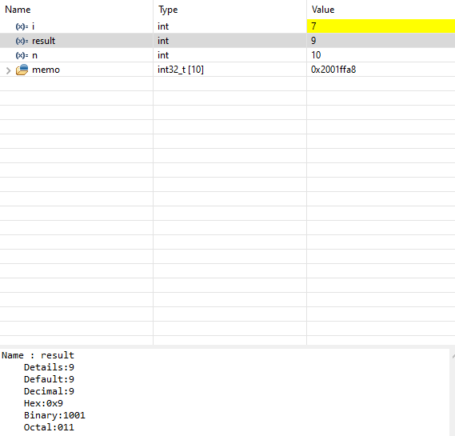
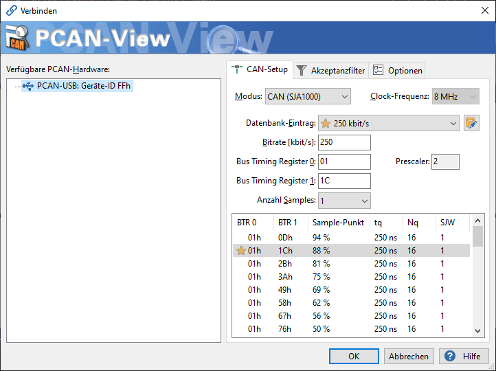
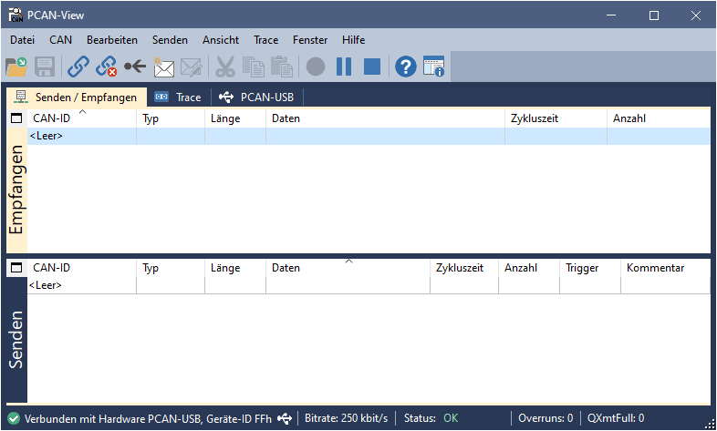
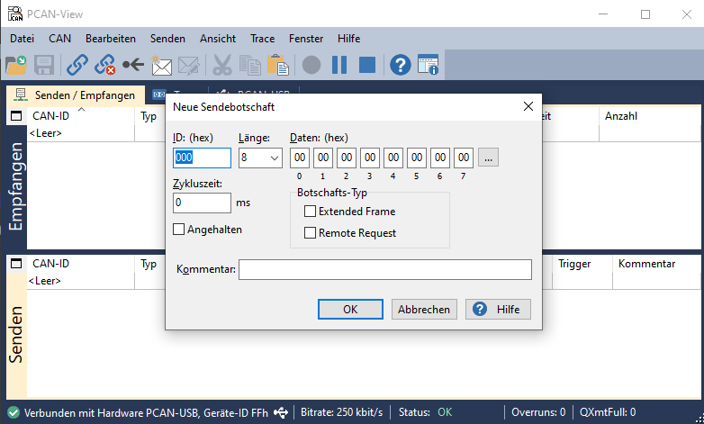

# Onboarding

## 1. Introduction

### 1.1 Tools and Installations

To get started with the STM32 Microcontroller, you will need to install the following tools:  
<ul>
<li>CubeIDE: The CubeIDE is a designated IDE exclusively for the STM-Microcontrollers.  
You can may download it from <a href = "https://www.st.com/en/development-tools/stm32cubeide.html" target="_top">here</a>.

<li> GNU Arm Embedded Toolchain: The Arm GNU Toolchain provides a collection of tools for C, C++ and assembly programming. 
You can download it from <a href="https://developer.arm.com/downloads/-/gnu-rm" target="_top">here</a>.  
<strong>Important: Only install the none eabi version!</strong>
</ul>

For the use of version control on windows, you have to install Git. It comes with a graphical and UNIX-based shell interface. You can download it from <a href="https://git-scm.com/" target="_top">here</a>

For GitHub and the CubeIDE you will need an account. You can register with your company email:
<ul>
<li> <a href="https://www.github.com" target="_top">GitHub</a>
<li> <a href="https://www.st.com/content/st_com/en.html" target="_top">STMicroelectronics</a>
</ul>

### 1.2 CubeIDE Introduction

To get familiar with the IDE and the Microcontroller, you can follow
<a href="https://wiki.st.com/stm32mcu/wiki/STM32StepByStep:Step2_Blink_LED" target="_top">this</a> step by step guide for creating a new simple LED blinking project. Select in the <strong>Board Selector</strong> the <strong>NUCLEO-F446RE</strong> board and name the project <strong>Blinki</strong>. This project will be important for another exercise.

Analyze some of the generated functions. Especially <strong> MX_GPIO_Init()</strong>. Compare it with the Blinki.ioc file and try to understand how it works.  
Extend the program, so that the LED can be turned on or off by the blue user button. You can lookup in <a href="https://www.st.com/resource/en/user_manual/um1724-stm32-nucleo64-boards-mb1136-stmicroelectronics.pdf" target="_top">this datasheet </a> which pin is used by the user button. Check again the code.  
What changed after adding a new configuration to the .ioc file?  

Hint: You may need to log in with your STM account in the CubeIDE to have full access to all tools.  
Hint: If the button "Generate Code" is missing you can click on: <strong>Project &rarr; Generate Code</strong>.

### 1.3 SSH Key generation and configuration

Create a new local environment variable <strong>%HOME%</strong> in your Windows system and set it to your home directory <strong>C:\Users\[yourusername]</strong>. 
Git Bash will use this environment variable as its home directory <strong>~</strong>.

Now start the <strong>Git Bash</strong>. Generate a new SSH-Private/Public key-pair by using the <strong>ssh-keygen</strong> followed with a chosen algorithm. <a href="https://docs.github.com/en/authentication/connecting-to-github-with-ssh/generating-a-new-ssh-key-and-adding-it-to-the-ssh-agent#generating-a-new-ssh-key" target="_top">This section</a> might help you to generate the key-pair. The generated keys should be stored in your home directory <strong>C:\Users\[yourusername]\.ssh</strong>. To help managing your ssh-keys, rename them with the date of creation, the name of the host and the algorithm used for both public and private key, e.g. <strong>20231031\_github\_ed25519</strong>. 

Now copy the content of your public key. Go to your GitHub Account &rarr; Settings &rarr; SSH and GPG Keys. Add the copied public key to the SSH keys. 

Although you have now setup the public key, your system won't trust the git host. To do this, you need to create a configuration file in the .ssh directory. Follow these steps:
<ol>
<li> Create a new file without file extension using the command <strong>touch</strong>: <code>touch config</code>.
<li> Open the file using a text editor.
<li> To define the host, add: <code>Host [git host]</code>.
<li>  To define the corresponding private key, add: <code> IdentityFile ~/.ssh/"private key name"</code>.
<li> Save and close the file.
</ol>

You can now test if a SSH-connection can be established and if your user credentials are authenticated by using <strong>ssh -T git@github.com</strong>. You may need to add GitHub as a trusted host by adding its "fingerprint" to the ssh-agent. 

### 1.4 Version Control with Git

<a href="https://github.com/joshnh/Git-Commands#git-commands" target="_top">This list</a> can be helpful working with Git-commands if you are not familiar
with them.

Open up Git Bash in your Blinki-project folder and create a local git repos-
itory. Also create a remote repository on your GitHub account. You can
name it like your STM-project.  
Define a <strong>.gitignore</strong> file without file extension. Open it in a text editor and
add the <strong>Debug directory</strong> and all files with the <strong>.elf</strong> extension (with wildcard
operator *). With this file the Debug-directory and all .elf files will be ex-
cluded from the repository because these files are always generated when
building the application.

Check the current status of the repository. Red marked files mean that they
are not added at the moment to the repository. Add these files and commit
them with a commit message, for instance ”init”. Now add all files to the
local repository and commit them with a message.

Create a new branch called <strong>main</strong> by using: <code> git branch -M main</code>.

Now add your remote repository to your local repository. Keep in mind that
the protocol needs to be SSH (starting with git@github.com:... .git), not
HTTPS!

Push your work now on the remote repository. Use: <code>git push -u origin main</code>.  
Now visit the remote repository. You should see your files with your
commit message in your browser. Add a README file in your GitHub
remote repository and give a brief description of the program. Save and
commit the file to the main branch.

Switch to your local repository. To get the README file, you need to update
your local repository. Now your local repository should be up to date.  
You can use <code>git log</code> to see your commit history.

### 1.5 CubeIDE Debugging

Clone <a href="https://github.com/leonv01/BlinkiLED" target="_top">this repository</a> in your CubeIDE workspace
(...\User.NAME\STM32CubeIDE\workspace 1.13.x). Open the project and
get familiar with the code. Use the debugger to analyze the behavior of the
program and switch to the corresponding Debugger-View. 

Observe the values and results from the calculation. Use the debugger steps
to coordinate through the code and use breakpoints to stop at specific lines.
Set a breakpoint at the function call for the fibonacci-function and use the
<strong>step into</strong> button. Watch the variables and its content in the debugger view.
You can also step back out of the function by using <strong>step return</strong> button.  
 
What value does <strong>result</strong> have after <strong>i = 7</strong> iterations?

## 2. Toolchain
### 2.1 Setting up workspace

Windows has an integrated Linux environment, including command-line tools
and applications that can access the Windows file system and programs. This
allows using Unix exclusive software to run on Windows without a big over-
head. This feature called WSL (Windows Subsystem for Linux). Read <a href="https://learn.microsoft.com/en-us/windows/wsl/install" target="_top">this documentation</a> to see the needed commands.  
You also have to install the <a href="https://www.st.com/en/development-tools/stsw-link004.html" target="_top">STM32 ST-Link utitlity</a>. It comes with a com-
mand line interface executable which is mandatory for flashing data to the
hardware.

Install the WSL command in administrator mode. Restart your PC and
print out the list of available distributions. Install Ubuntu 20.04 (LTS) and set it up.

After finishing the setup, open up Ubuntu 20.04 from your Windows searchbar and first update and afterwards upgrade your packages. You can look up the <a href="https://manpages.ubuntu.com/manpages/trusty/en/man8/apt.8.html" target="_top">commands</a> if you are not familiar with them. When this is finished install <strong>make</strong>.

Switch back to your Windows system. Install the the <a href="https://developer.arm.com/downloads/-/gnu-rm" target="_top">Arm GNU Toolchain</a> for the Linux System. Choose the <strong>x86_64-linux.tar.bz2</strong> file and download it. Move it to you your subsystem folder. Extract it and add the binaries to the Linux system by using:  
<code>sudo tar xjf gcc-arm-none-eabi-*.bz2 -C /usr/share/</code>.   You can use the following command to add the gcc, gdb, g++, size and objcopy of the package:  
<code>sudo ln -s /usr/share/gcc-arm-eabi-YOUR VERSION/bin/arm-none-eabi-gcc /usr/bin/arm-none-eabi-gcc</code>. 
This is done for the C-Compiler, add the rest by replacing the gcc with the other four binary files.

Hint: You can use <code>explorere.exe</code> in the WSL subsystem to open up the Windows file explorer within the Linux filesystem.

Add the needed dependencies for the Arm GNU Toolchain by installing the package <strong>libncurses-dev</strong>. You need to make the package compatible. You can do this by creating the two symbolic links:
<ul>
<li> <code>sudo ln -s /usr/lib/x86 64-linux-gnu/libncurses.so.6 /usr/lib/x86 64-linux-gnu/libncurses.so.5</code>
<li> <code>sudo ln -s /usr/lib/x86 64-linux-gnu/libncurses.so.6 /usr/lib/x86 64-linux-gnu/libtinfo.so.5</code>
</ul>
Check if it worked by printing out the version, e.g. <code>arm-none-eabi-gcc --version</code>

### 2.2 ST-Link

Clone <a href="https://github.com/Egon2k/STM32F446RE_MinimumBlinky/tree/main" target="_top">this repository</a> to your Linux subsystem. Get familiar with the code and understand what the program is doing. Also have a look at the <strong>Makefile</strong>. <a href="https://opensource.com/article/18/8/what-how-makefile" target="_top">Here</a> is an explanation with examples of how Makefiles work and how to use them. 

Compile the program with the Makefile. Right now nothing will happen with the microcontroller because the compiled binary is not flashed to the system's memory. This can be done by using the ST-Link utility tool. You can read the documentation of the tool in the documents folder to get familiar with it (especially look at chapter 4!). 

You can test out the ST-Link tool by open up powershell and typing: <code> ST-LINK_CLI.exe -c</code>. This will print out the informations of the microcontroller.

Extend the Makefile by another target, e.g. <strong>flash</strong>. You can use Windows applications within WSL by using the programs with the .exe extension. Use the ST-Link to flash the program to the microcontroller and set parameters right. Also implement a target to erase the program from the microcontroller memory.

Hint: The address for the flashing is <strong>0x08000000</strong>. Also the microcontroller needs to be reset after flashing. 

## 3. CAN bus
### 3.1 Prerequisites

Inform yourself about the CAN bus and how it works. <a href="https://en.wikipedia.org/wiki/CAN_bus" target="_top">This wikipedia article</a> provides a good summary of the protocol. Also you need to install PCAN-View from <a href="https://www.peak-system.com/PCAN-USB.199.0.html" target="_top">here</a> to send and/or receive data to your Windows system.

### 3.2 Setting up a new project

Connect the MCP2551 CAN-controller to the STM board. Look up the <a href="https://os.mbed.com/platforms/ST-Nucleo-F446RE/" target="_top">pinlayout</a> and create a new STM32Cube project. Configure the pins so that they can use the CAN protocol. Afterwards go to the CAN1 configuration under the category Connectivity.

In order to send messages via CAN, you have to setup the bit timings. <a href="http://www.bittiming.can-wiki.info/" target="_top">This website</a> gives you a bunch of presets for the configuration. Change the board to <code>ST Microelectronics bxCAN</code>. You can ignore the <code>Sample-Point</code> and <code>SJW</code> values.  
Determine the timing values for a baud-rate of 250 kbit/s. Add these values to the .ioc file int he CubeIDE. Also take a look at the example of the sample point and understand what it does.

Hint: The clock frequency of the STM board is 42 MHz.

### 3.3 Sending Messages

Connect the PCAN adapter with the CAN-controller and start PCAN-View. Set the bitrate to 250 kbit/s.  
In the upper half you can see the received packages. In the other half you can create a message with an ID and payload.

Read <a href="https://controllerstech.com/can-protocol-in-stm32/" target="_top">this article</a> to setup the CAN dataframe. Extend your main program to allow sending a message from the STM board to your Windows system by pressing the blue user button. 

Hint: Before activating the Notifications for the CAN bus with <code>CAN_HAL_ActivateNotification</code> you need to start the CAN bus with <code>CAN_HAL_Start(&hcan1);</code>.

### 3.4 Receiving Messages

Follow the guide of the article and get familiar with filters. In order to receive messages a filter is necessary. For now let all messages pass through.  
To send a message from your Windows system, right click on the lower half in PCAN-View to create a new message. You can define the ID, payload length and payload data. The cycletime defines the cyclic sending of data. Both extended frame and remote request are not necessary and can be left deselected.

Implement the example from the article so that the LED blinks with the data given from the payload of the CAN message. Also add an 'echo', so that the STM board answers after each received message. 

### 3.5 Filter Messages

To understand how the filter works, you can follow <a href="https://youtu.be/JfWlIY0zAIc?feature=shared" target="_top">this YouTube video</a> which is also on the article that provides an understandable explanation.

Change the filter settings so that only messages with the ID from 0x000 to 0x00F are accepted. You can also play around with different settings for the <code>FilterIdHigh</code> and <code>FilterMaskIdHigh</code> to get a better understanding.

