# Onboarding Solution

## 1. User button LED toggle

Configure both pins: 
 
Set the pin mode of PC13 to <strong>GPIO_Input</strong>
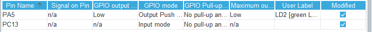 
Add the toggle code to the main loop: 
<code>
int main(){ 
&nbsp;... 
&nbsp;while(1){ 
&ensp;if(!HAL_GPIO_ReadPin(GPIOC, GPIO_PIN_13)){ 
&nbsp;&nbsp;HAL_GPIO_WritePin(GPIOA, GPIO_PIN_5, GPIO_PIN_SET); 
&nbsp;} 
&nbsp;else{ 
&nbsp;&nbsp;HAL GPIO WritePin(GPIOA, GPIO PIN 5 , GPIO PIN RESET); 
&nbsp;} 
}
</code>

### 1.2 SSH Key generation and configuration

To create a new environment variable, go to your Windows search bar and search for <strong>"Edit environment variables for your account"</strong>.  
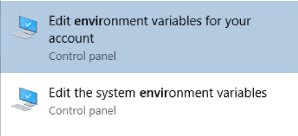 
Add a new user variable <strong>HOME</strong> and set it to your C-drive home directory, e.g. <strong>C:\Users\user.NAME</strong>. 
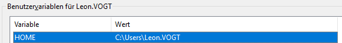 
Generating a new SSH key-pair:  
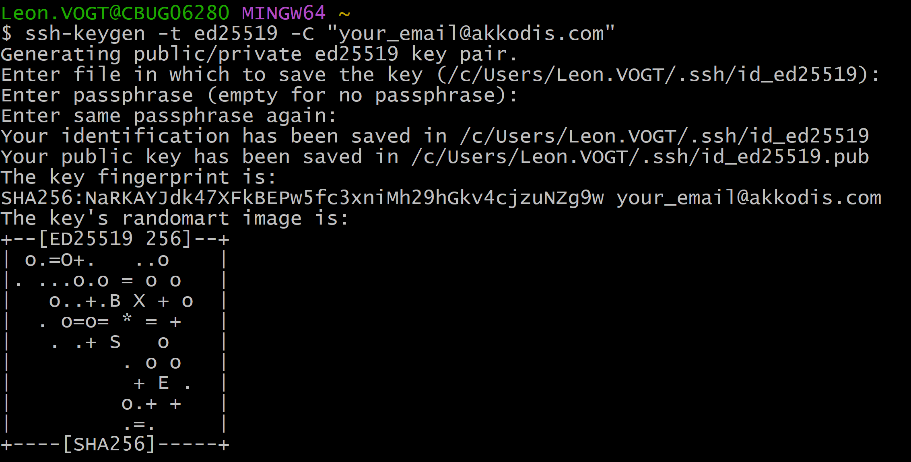 
To rename it, go into the .ssh directory:
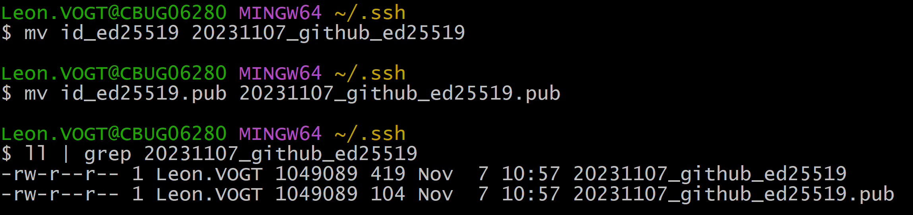 
Now copy the public key:
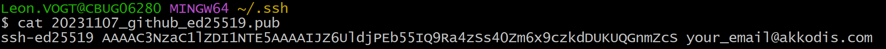 
Adding the key requires you to go to your GitHub account settings &rarr; SSH and GPG keys &rarr; new SSH key: 
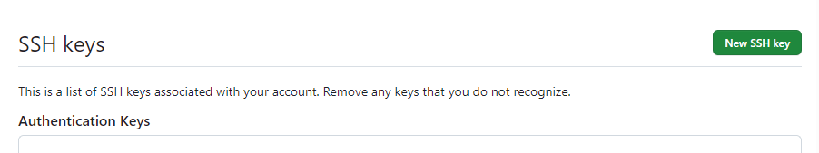 
Creating the config file: 
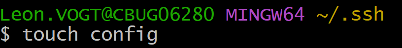 
Edit the file with an editor of your choice and add the Host and the path to the corresponding private key:  
 
Testing the authentification: 
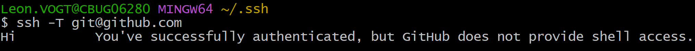 

### 1.3 Version Control with Git

Initializing a local repository: 
 
Creating a remote repository: 
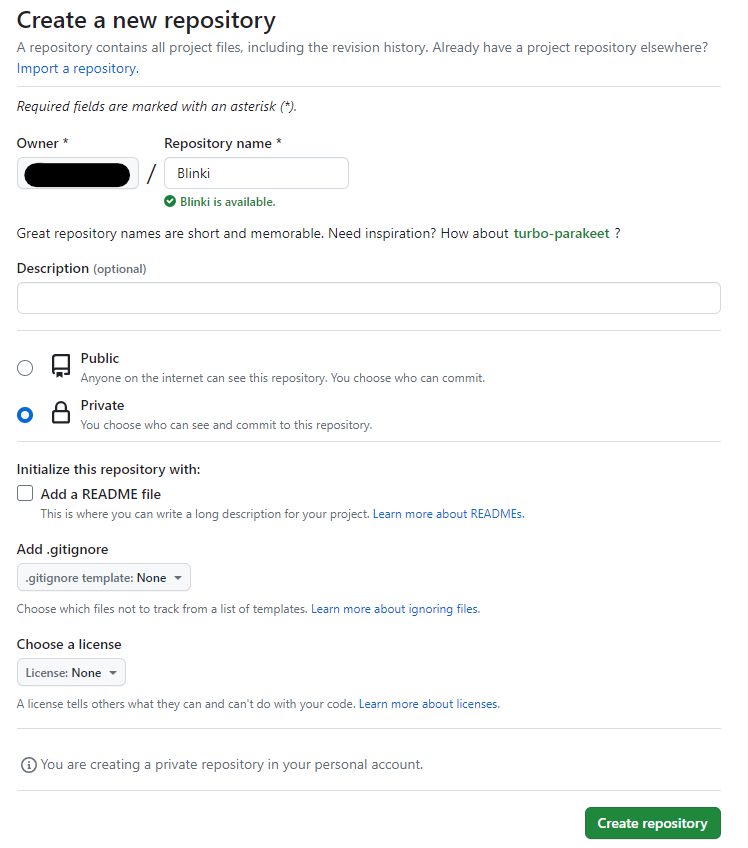 
.gitignore file definition: 
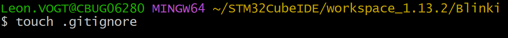 
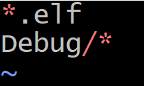 
Adding files and committing them with a message: 
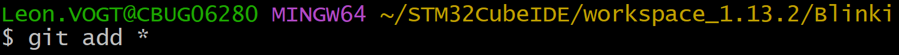 
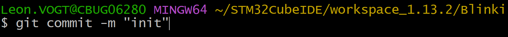 
Creating a new branch: 
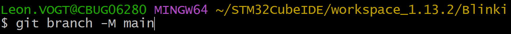 
Adding the remote repository with SSH to the local repository: 
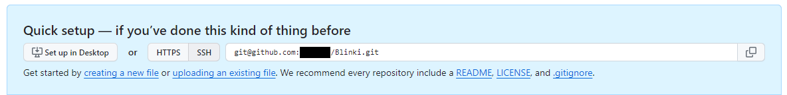 
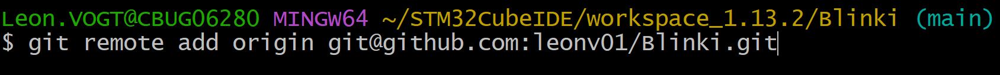 
Pushing commit to remote repository: 
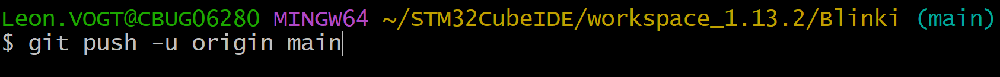

### 1.4 Debugger

After <code>i = 7</code> iterations: 
 
 

--

## 2. Toolchain
### 2.1 Setting up workspace

Installing WSL: 
<code>wsl --install</code>

List all distributions: 
<code>wsl --list --online</code>

Update/Upgrade apt and install make package: 
<ol>
<li><code>sudo apt -y update</code></li>
<li><code>sudo apt -y upgrade</code></li>
<li><code>sudo apt -y install make</code></li>
<li><code>sudo apt -y install libncurses-dev</code></li>
</ol>

Adding compiler etc. to the linux system: 
<ol>
<li><code>sudo tar xjf gcc-arm-none-eabi-*.bz2 -C /usr/share/</code></li>
<li><code>sudo ln -s /usr/share/gcc-arm-eabi-YOUR VERSION/bin/arm-none-eabi-gcc /usr/bin/arm-none-eabi-gcc</code></li>
<li><code>sudo ln -s /usr/share/gcc-arm-eabi-YOUR VERSION/bin/arm-none-eabi-gdb /usr/bin/arm-none-eabi-gdb</code></li>
<li><code>sudo ln -s /usr/share/gcc-arm-eabi-YOUR VERSION/bin/arm-none-eabi-g++ /usr/bin/arm-none-eabi-g++</code></li>
<li><code>sudo ln -s /usr/share/gcc-arm-eabi-YOUR VERSION/bin/arm-none-eabi-size /usr/bin/arm-none-eabi-size</code></li>
<li><code>sudo ln -s /usr/share/gcc-arm-eabi-YOUR VERSION/bin/arm-none-eabi-objcopy /usr/bin/arm-none-eabi-objcopy</code></li>
</ol>

Making libncurses compatible with arm-none-eabi-gdb: 
<ul>
<li> <code>sudo ln -s /usr/lib/x86 64-linux-gnu/libncurses.so.6 /usr/lib/x86 64-linux-gnu/libncurses.so.5</code>
<li> <code>sudo ln -s /usr/lib/x86 64-linux-gnu/libncurses.so.6 /usr/lib/x86 64-linux-gnu/libtinfo.so.5</code>
</ul>

### 2.2 ST-Link

Makefile advancement: 
<code>flash: all</code> 
<code>ST-LINK_CLI.exe -P $(TARGET).bin 0x08000000 -V -Rst</code>

<code>clean</code> 
<code>ST-LINK_CLI.exe -ME</code>

--

## 3 CAN bus
### 3.1 Setting up a new project

Project ioc file: 
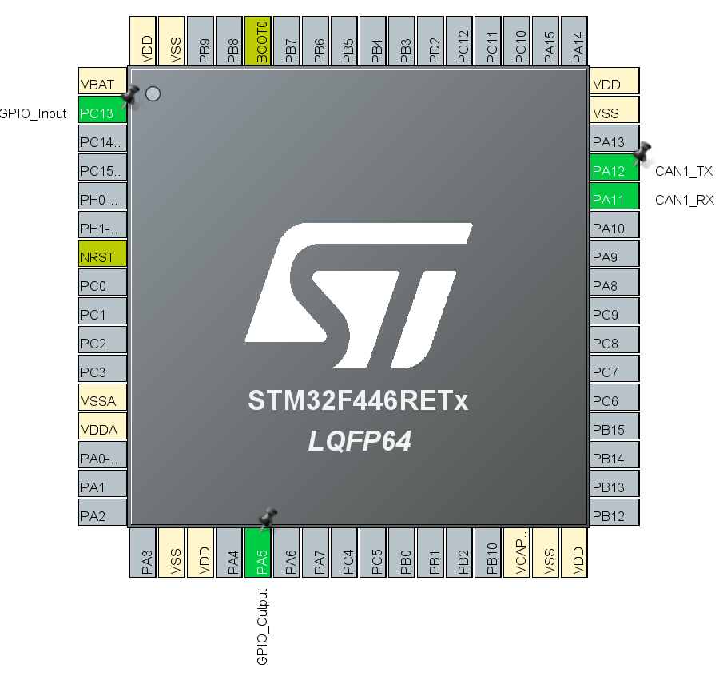

CAN configuration: 
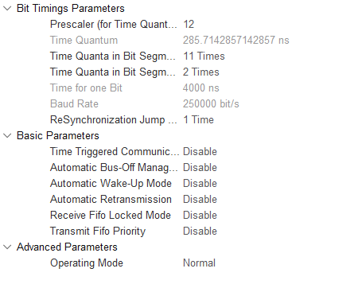

### 3.3 Sending Messages
Setting up CAN bus: 
<code>
CAN_TxHeaderTypeDef TxHeader; 
uint8_t TxData[8]; 
uint32_t TxMailbox; 
 
int main(void){ 
&nbsp;... 
&nbsp;char message[] = {'H', 'e', 'l', 'l', 'o'}; 
&nbsp;HAL_CAN_Start(&hcan1); 
&nbsp;if (HAL_CAN_ActivateNotification(&hcan1, CAN_IT_RX_FIFO0_MSG_PENDING) != HAL_OK) 
&nbsp;{ 
&nbsp;&nbsp;Error_Handler(); 
&nbsp;} 
} 
TxHeader.IDE = CAN_ID_STD; 
TxHeader.StdId = 0x446; 
TxHeader.DLC = sizeof(message); 
TxHeader.RTR = CAN_RTR_DATA; 
 
while(1){ 
&nbsp;if(!HAL_GPIO_ReadPin(GPIOC, GPIO_PIN_13)){ 
&nbsp;&nbsp;TxHeader.IDE = CAN_ID_STD; 
&nbsp;&nbsp;TxHeader.StdId = 0x446; 
&nbsp;&nbsp;TxHeader.DLC = sizeof(message); 
&nbsp;&nbsp;TxHeader.RTR = CAN_RTR_DATA; 
 
&nbsp;&nbsp;for(int i = 0; i < sizeof(message); i++){ 
&nbsp;&nbsp;&nbsp;TxData[i] = message[i]; 
&nbsp;&nbsp;} 
&nbsp;&nbsp;HAL_CAN_AddTxMessage(&hcan1, &TxHeader, TxData, &TxMailbox); 
&nbsp;&nbsp;HAL_Delay(100); 
&nbsp;} 
}
</code>

### 3.4 Receiving Messages
<code>
CAN_RxHeaderTypeDef RxHeader; 
uint8_t RxData[8]; 

int datacheck; 
void HAL_CAN_RxFifo0MsgPendingCallback(CAN_HandleTypeDef *hcan){ 
&nbsp;if(HAL_CAN_GetRxMessage(hcan, CAN_RX_FIFO0, &RxHeader, RxData) != HAL_OK){ 
&nbsp;&nbsp;Error_Handler(); 
&nbsp;} 
 
&nbsp;if(RxHeader.DLC == 2){ 
&nbsp;&nbsp;datacheck = 1; 
&nbsp;} 
} 
 
int main(void){ 
&nbsp;... 
&nbsp;char answer[] = {'D', 'o', 'n', 'e'}; 
&nbsp;... 
 
&nbsp;while(1){ 
&nbsp;&nbsp;if(datacheck){ 
&nbsp;&nbsp;int delay = RxData[1]; 
&nbsp;&nbsp;for(int i = 0; i < RxData[0]; i++){ 
&nbsp;&nbsp;&nbsp;HAL_GPIO_WritePin(GPIOA, GPIO_PIN_5, GPIO_PIN_SET); 
&nbsp;&nbsp;&nbsp;HAL_Delay(delay); 
&nbsp;&nbsp;&nbsp;HAL_GPIO_WritePin(GPIOA, GPIO_PIN_5, GPIO_PIN_RESET); 
&nbsp;&nbsp;&nbsp;HAL_Delay(delay); 
&nbsp;&nbsp;} 
 
&nbsp;&nbsp;TxHeader.IDE = CAN_ID_STD; 
&nbsp;&nbsp;TxHeader.StdId = 0x123; 
&nbsp;&nbsp;TxHeader.DLC = sizeof(answer); 
&nbsp;&nbsp;TxHeader.RTR = CAN_RTR_DATA; 
 
&nbsp;&nbsp;for(int i = 0; i < sizeof(answer); i++){ 
&nbsp;&nbsp;&nbsp;TxData[i] = answer[i]; 
&nbsp;&nbsp;} 
&nbsp;&nbsp;HAL_CAN_AddTxMessage(&hcan1, &TxHeader, TxData, &TxMailbox); 
&nbsp;&nbsp;datacheck = 0; 
&nbsp;} 
}
 
...
 
static void MX_CAN1_Init(void){ 
&nbsp;hcan1.Instance = CAN1; 
&nbsp;hcan1.Init.Prescaler = 12; 
&nbsp;hcan1.Init.Mode = CAN_MODE_NORMAL; 
&nbsp;hcan1.Init.SyncJumpWidth = CAN_SJW_1TQ; 
&nbsp;hcan1.Init.TimeSeg1 = CAN_BS1_11TQ; 
&nbsp;hcan1.Init.TimeSeg2 = CAN_BS2_2TQ; 
&nbsp;hcan1.Init.TimeTriggeredMode = DISABLE; 
&nbsp;hcan1.Init.AutoBusOff = DISABLE; 
&nbsp;hcan1.Init.AutoWakeUp = DISABLE; 
&nbsp;hcan1.Init.AutoRetransmission = DISABLE; 
&nbsp;hcan1.Init.ReceiveFifoLocked = DISABLE; 
&nbsp;hcan1.Init.TransmitFifoPriority = DISABLE; 
&nbsp;if (HAL_CAN_Init(&hcan1) != HAL_OK) 
&nbsp;{ 
&nbsp;&nbsp;Error_Handler(); 
&nbsp;} 
 
&nbsp;CAN_FilterTypeDef canFilterConfig; 
 
&nbsp;canFilterConfig.FilterActivation = CAN_FILTER_ENABLE; 
&nbsp;canFilterConfig.FilterBank = 10; 
&nbsp;canFilterConfig.FilterFIFOAssignment = CAN_RX_FIFO0; 
&nbsp;canFilterConfig.FilterIdHigh = 0x1F << 5; 
&nbsp;canFilterConfig.FilterIdLow = 0x0000; 
&nbsp;canFilterConfig.FilterMaskIdHigh = 0x4F0 << 5; 
&nbsp;canFilterConfig.FilterMaskIdLow = 0x0000; 
&nbsp;canFilterConfig.FilterMode = CAN_FILTERMODE_IDMASK; 
&nbsp;canFilterConfig.FilterScale = CAN_FILTERSCALE_32BIT; 
&nbsp;canFilterConfig.SlaveStartFilterBank = 0; 
 
&nbsp;HAL_CAN_ConfigFilter(&hcan1, &canFilterConfig); 
}
</code>

### 3.5 Filter Messages
<code>
&nbsp;CAN_FilterTypeDef canFilterConfig; 
 
&nbsp;canFilterConfig.FilterActivation = CAN_FILTER_ENABLE; 
&nbsp;canFilterConfig.FilterBank = 10; 
&nbsp;canFilterConfig.FilterFIFOAssignment = CAN_RX_FIFO0; 
&nbsp;canFilterConfig.FilterIdHigh = 0x1F << 5; 
&nbsp;canFilterConfig.FilterIdLow = 0x0000; 
&nbsp;canFilterConfig.FilterMaskIdHigh = 0x4F0 << 5; 
&nbsp;canFilterConfig.FilterMaskIdLow = 0x0000; 
&nbsp;canFilterConfig.FilterMode = CAN_FILTERMODE_IDMASK; 
&nbsp;canFilterConfig.FilterScale = CAN_FILTERSCALE_32BIT; 
&nbsp;canFilterConfig.SlaveStartFilterBank = 0; 
 
&nbsp;HAL_CAN_ConfigFilter(&hcan1, &canFilterConfig); 
}
</code>