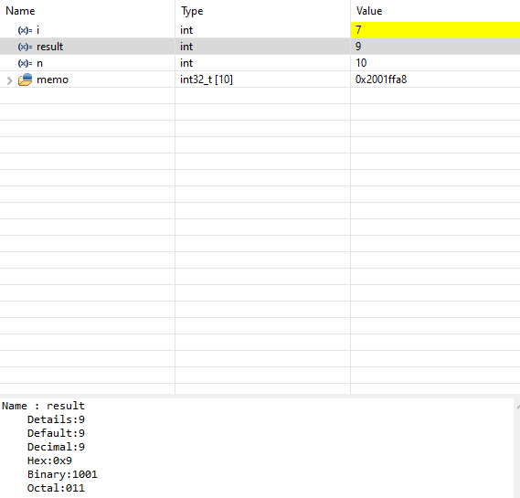
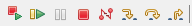

# Onboarding Solution

# 1. User button LED toggle

Configure both pins: 
 
Set the pin mode of PC13 to <strong>GPIO_Input</strong>
 
Add the toggle code to the main loop: 
<code>
int main(){ 
&nbsp;... 
&nbsp;while(1){ 
&ensp;if(!HAL_GPIO_ReadPin(GPIOC, GPIO_PIN_13)){ 
&nbsp;&nbsp;HAL_GPIO_WritePin(GPIOA, GPIO_PIN_5, GPIO_PIN_SET); 
&nbsp;} 
&nbsp;else{ 
&nbsp;&nbsp;HAL GPIO WritePin(GPIOA, GPIO PIN 5 , GPIO PIN RESET); 
&nbsp;} 
}
</code>

# 2. SSH Key generation and configuration

To create a new environment variable, go to your Windows search bar and search for <strong>"Edit environment variables for your account"</strong>.  
 
Add a new user variable <strong>HOME</strong> and set it to your C-drive home directory, e.g. <strong>C:\Users\user.NAME</strong>. 
 
Generating a new SSH key-pair:  
 
To rename it, go into the .ssh directory:
 
Now copy the public key:
 
Adding the key requires you to go to your GitHub account settings &rarr; SSH and GPG keys &rarr; new SSH key: 
 
Creating the config file: 
 
Edit the file with an editor of your choice and add the Host and the path to the corresponding private key:  
 
Testing the authentification: 
 

# 3. Version Control with Git

Initializing a local repository: 
 
Creating a remote repository: 
 
.gitignore file definition: 
 
 
Adding files and committing them with a message: 
 
 
Creating a new branch: 
 
Adding the remote repository with SSH to the local repository: 
 
 
Pushing commit to remote repository: 

# 4. Debugger

After <code>i = 7</code> iterations: 
 
 