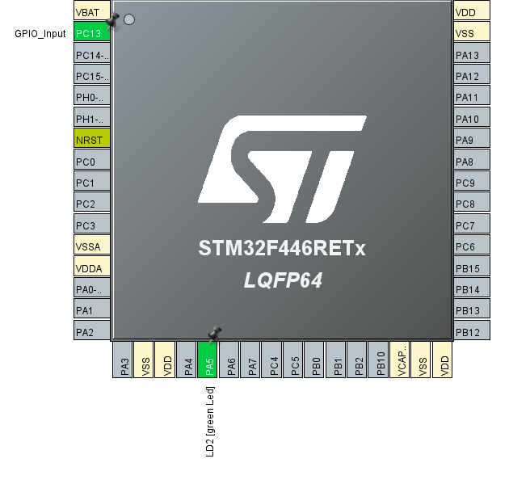
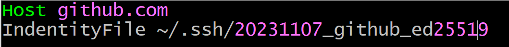

# Onboarding Solution

## 1. User button LED toggle
Configure both pins:<br>
<br>
Set the pin mode of PC13 to <strong>GPIO_Input</strong>
 \
Add the toggle code to the main loop: \
```c
int main(){
    // ...
    while(1){
        if(!HAL_GPIO_ReadPin(GPIOC, GPIO_PIN_13)){
            HAL_GPIO_WritePin(GPIOA, GPIO_PIN_5, GPIO_PIN_SET);
        }
        else{
            HAL GPIO WritePin(GPIOA, GPIO PIN 5 , GPIO PIN RESET);
        }
    }
}
```

### 1.2 SSH Key generation and configuration
To create a new environment variable, go to your Windows search bar and search for **"Edit environment variables for your account"**. \
 \
Add a new user variable **HOME** and set it to your C-drive home directory, e.g. **C:\Users\user.NAME**. \
 \
Generating a new SSH key-pair: \
 \
To rename it, go into the .ssh directory:
 \
Now copy the public key:
 \
Adding the key requires you to go to your GitHub account settings &rarr; SSH and GPG keys &rarr; new SSH key: \
 \
Creating the config file: \
 \
Edit the file with an editor of your choice and add the Host and the path to the corresponding private key: \
\
Testing the authentification:\
 \

### 1.3 Version Control with Git
Initializing a local repository:\
\
Creating a remote repository:\
\
.gitignore file definition:\
\
\
Adding files and committing them with a message:\
\
\
Creating a new branch:<br>
<br>
Adding the remote repository with SSH to the local repository:<br>
<br>
<br>
Pushing commit to remote repository:<br>

</p>

### 1.4 Debugger
<p>
After <code>i = 7</code> iterations:<br>
<br>
<br>

---

## 2. Toolchain
### 2.1 Setting up workspace
Installing WSL: \
`wsl --install`


List all distributions:\
`wsl --list --online`


Update/Upgrade apt and install make package:

1. `sudo apt -y update`
2. `sudo apt -y upgrade`
3. `sudo apt -y install make`
4. `sudo apt -y install libncurses-dev`


Adding compiler etc. to the linux system:\
1. `sudo tar xjf gcc-arm-none-eabi-*.bz2 -C /usr/share/`
2. `sudo ln -s /usr/share/gcc-arm-eabi-YOUR VERSION/bin/arm-none-eabi-gcc /usr/bin/arm-none-eabi-gcc`
3. `sudo ln -s /usr/share/gcc-arm-eabi-YOUR VERSION/bin/arm-none-eabi-gdb /usr/bin/arm-none-eabi-gdb`
4. `sudo ln -s /usr/share/gcc-arm-eabi-YOUR VERSION/bin/arm-none-eabi-g++ /usr/bin/arm-none-eabi-g++`
5. `sudo ln -s /usr/share/gcc-arm-eabi-YOUR VERSION/bin/arm-none-eabi-size /usr/bin/arm-none-eabi-size`
6. `sudo ln -s /usr/share/gcc-arm-eabi-YOUR VERSION/bin/arm-none-eabi-objcopy /usr/bin/arm-none-eabi-objcopy`


Making libncurses compatible with arm-none-eabi-gdb: \
- `sudo ln -s /usr/lib/x86 64-linux-gnu/libncurses.so.6 /usr/lib/x86 64-linux-gnu/libncurses.so.5`
- `sudo ln -s /usr/lib/x86 64-linux-gnu/libncurses.so.6 /usr/lib/x86 64-linux-gnu/libtinfo.so.5`

### 2.2 ST-Link
Makefile advancement:\
`flash: all`\
`ST-LINK_CLI.exe -P $(TARGET).bin 0x08000000 -V -Rst`

`clean`\
`ST-LINK_CLI.exe -ME`

---

## 3 CAN bus
### 3.1 Setting up a new project
Project ioc file:\


CAN configuration:\


### 3.3 Sending Messages
Setting up CAN bus: \
```c
CAN_TxHeaderTypeDef TxHeader;
uint8_t TxData[8];
uint8_t TxMailbox;

int main(void){
    // ...
    char message[] = {'H', 'e', 'l', 'l', 'o'};
    HAL_CAN_Start(&hcan1);
    if(HAL_CAN_ActiveNotification(&hcan1, CAN_IT_RX_FIFO0_MSG_PENDING) != HAL_OK){
        Error_Handler();
    }

    TxHeader.IDE = CAN_ID_STD;
    TxHeader.StdId = 0x446;
    TxHeader.DLC = sizeof(message);
    TxHeader.RTR = CAN_RTR_DATA;

    while(1){
        if(!HAL_GPIO_ReadPin(GPIOC, GPIO_PIN_13)){
              TxHeader.IDE = CAN_ID_STD;TxHeader.StdId = 0x446;
              TxHeader.DLC = sizeof(message);
              TxHeader.RTR = CAN_RTR_DATA;

              for(int i = 0; i < sizeof(message); i++){
                TxData[i] = message[i];
              }

              HAL_CAN_AddTxMessage(&hcan1, &TxHeader, TxData, &TxMailbox);
              HAL_Delay(100);
        }
    }        
}
```

### 3.4 Receiving Messages
```c
CAN_RxHeaderTypeDef RxHeader;
uint8_t RxData[8];

int datacheck;
void HAL_CAN_RxFifo0MsgPendingCallback(CAN_HandleTypeDef *hcan){
    if(HAL_CAN_GetRxMessage(hcan, CAN_RX_FIFO0, &RxHeader, RxData) != HAL_OK){
        Error_Handler();
    }

    if(RxHeader.DLC == 2){
        datacheck = 1;
    }
}

int main(void){
    // ...
    char answer[] = {'D', 'o', 'n', 'e'};
    // ...
    
    while(1){
        if(datacheck){
            int delay = RxData[1];
            for(int i = 0; i < RxData[0]; i++){
                HAL_GPIO_WritePin(GPIOA, GPIO_PIN_5, GPIO_PIN_SET);
                HAL_Delay(delay);
                HAL_GPIO_WritePin(GPIO, GPIO_PIN_5, GPIO_PIN_RESET);
                HAL_Delay(delay);
            }

            TxHeader.IDE = CAN_ID_STD;
            TxHeader.StdId = 0x123;
            TxHeader.DLC = sizeof(answer)
            TxHeader.RTR = CAN_RTR_DATA;

            for(int i = 0; i < sizeof(answer); i++){
                TxData[i] = answer[i];
            }

            HAL_CAN_AddTxMessage(&hcan1, &TxHeader, TxData, &TxMailbox);
            datacheck = 0;
        }
    }

 // ...

 static void MX_CAN1_Init(void){
    hcan1.Instance = CAN1;
    hcan1.Init.Prescaler = 12;
    hcan1.Init.Mode = CAN_MODE_NORMAL;
    hcan1.Init.SyncJumpWidth = CAN_SJW_1TQ;
    hcan1.Init.TimeSeg1 = CAN_BS1_11TQ;
    hcan1.Init.TimeSeg2 = CAN_BS2_2TQ;
    hcan1.Init.TimeTriggeredMode = DISABLE;
    hcan1.Init.AutoBusOff = DISABLE;
    hcan1.Init.AutoWakeUp = DISABLE;
    hcan1.Init.AutoRetransmission = DISABLE;
    hcan1.Init.ReceiveFifoLocked = DISABLE;
    hcan1.Init.TransmitFifoPriority = DISABLE;
    if (HAL_CAN_Init(&hcan1) != HAL_OK)
    {
        Error_Handler();
    }

    CAN_FilterTypeDef canFilterConfig;

    canFilterConfig.FilterActivation = CAN_FILTER_ENABLE;
    canFilterConfig.FilterBank = 10;
    canFilterConfig.FilterFIFOAssignment = CAN_RX_FIFO0;
    canFilterConfig.FilterIdHigh = 0x1F << 5;
    canFilterConfig.FilterIdLow = 0x0000;
    canFilterConfig.FilterMaskIdHigh = 0x4F0 << 5;
    canFilterConfig.FilterMaskIdLow = 0x0000;
    canFilterConfig.FilterMode = CAN_FILTERMODE_IDMASK;
    canFilterConfig.FilterScale = CAN_FILTERSCALE_32BIT;
    canFilterConfig.SlaveStartFilterBank = 0;

    HAL_CAN_ConfigFilter(&hcan1, &canFilterConfig);
}
```


### 3.5 Filter Messages
```c
 CAN_FilterTypeDef canFilterConfig;

 canFilterConfig.FilterActivation = CAN_FILTER_ENABLE;
 canFilterConfig.FilterBank = 10;
 canFilterConfig.FilterFIFOAssignment = CAN_RX_FIFO0;
 canFilterConfig.FilterIdHigh = 0x1F << 5;
 canFilterConfig.FilterIdLow = 0x0000;
 canFilterConfig.FilterMaskIdHigh = 0x4F0 << 5;
 canFilterConfig.FilterMaskIdLow = 0x0000;
 canFilterConfig.FilterMode = CAN_FILTERMODE_IDMASK;
 canFilterConfig.FilterScale = CAN_FILTERSCALE_32BIT;
 canFilterConfig.SlaveStartFilterBank = 0;

 HAL_CAN_ConfigFilter(&hcan1, &canFilterConfig);
